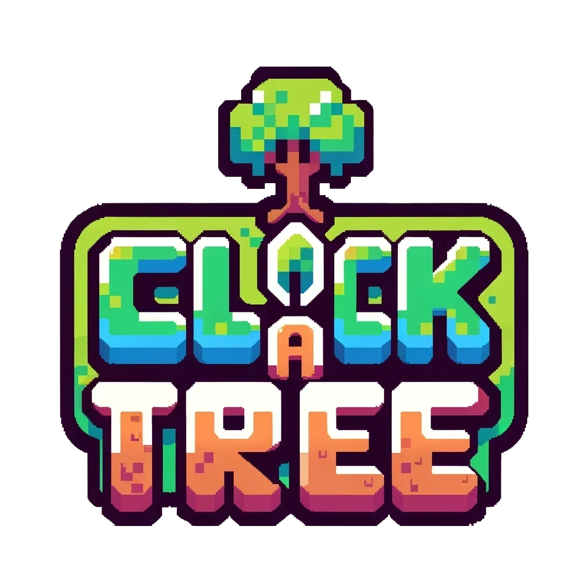
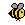
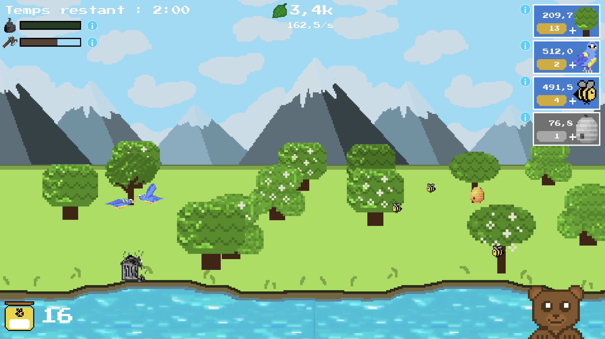

    

Bienvenue dans Click a Tree, le jeu de clicker ultime où votre pouce vert prend le devant de la scène ! Plongez dans le monde amusant de la plantation, de la croissance et de la défense de votre propre forêt virtuelle. Préparez-vous à une aventure feuillue ! 🌳

## Aperçu du Jeu 🌿

### Description 🌲

Click a Tree n'est pas un jeu de clicker ordinaire - c'est votre propre forêt numérique ! Cliquez pour relever des défis, débloquer des éléments d'écosystème quasi-magiques et déjouer les forces qui menacent votre paradis vert. Il s'agit de grandir !

### Caractéristiques 🌍

- **👇 Cliquer pour Grandir:** Commencez petit, cliquez grand ! Chaque tapotement donne vie à votre forêt naissante.
- **🐝 Abeilles et Miel:** Invoquez des abeilles diligentes pour récolter du miel pour un petit ours
- **🔥 Défendre et Conquérir:** Affrontez des défis insolites, notamment un bulldozer et la pollution en mettant en place des stratégies pour que vos arbres restent debout.
- **🍃 Amélioration et Expansion:** Dépensez vos ressources durement gagnées pour améliorer votre forêt, découvrir de nouveaux arbres et créer des paysages à couper le souffle !

## Credits 🌟

- **🧩 Concept et Développement:** Sophie Ward & André "AnJoMorto" Fonseca
- **🎨 Conception visuelle:** Les visuels ont été créés sur Piskel par Sophie Ward & André "AnJoMorto" Fonseca

- **👥 Sources Extérieures :**
    - Musique : [mayragandra](https://mayragandra.itch.io/freeambientmusic)
    - Sons : Itch.io : [Brackeys, Asbjørn Thirslund](https://brackeysgames.itch.io/brackeys-platformer-bundle), [Diablo Luna](https://pudretediablo.itch.io/butterfly), [FilmCow](https://filmcow.itch.io/filmcow-sfx), [Leohpaz](https://leohpaz.itch.io/minifantasy-forgotten-plains-sfx-pack), [Nathan Gibson](https://nathangibson.myportfolio.com), [Nox_Sound_Design](https://nox-sound-design.itch.io/essentials-series-sfx-nox-sound)
    - Snippets de code : Stackoverflow : [MarredCheese](https://stackoverflow.com/questions/9461621/format-a-number-as-2-5k-if-a-thousand-or-more-otherwise-900/63066148) et [Vishal](https://stackoverflow.com/a/11486026)
    - Assistant IA : [OpenAI, ChatGPT](https://chat.openai.com) (dont GPT-3.5, GPT-4o et [Code Copilot](https://promptspellsmith.com/))

Ce projet a été développé dans le cadre du cours "Développement de Jeu 2D" under Isaac Pante (SLI, Lettres, UNIL, Lausanne, CH).

## Jouez sur itch.io! 🎮

Notre jeu est disponible sur [itch.io](https://anjomorto.itch.io/click-a-tree) ! Il suffit de cliquer sur **RUN GAME** ! 🌳💚

    

